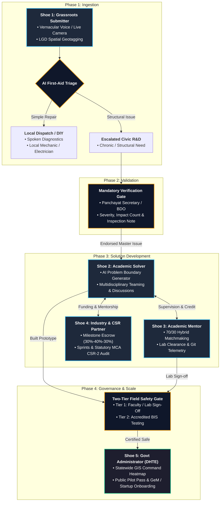

### Audit Verdict: Completeness & Alignment Check

**Verdict:** **98% Complete and Fully Aligned.**

The requirements document covers the quadruple-helix model, the core 5 personas, the AI problem translator, live camera constraints, LGD reverse-geocoding, the 2-tier safety gate, and the milestone escrow system.

However, cross-checking against every design decision and jury-defense point from our earlier discussions reveals **5 specific technical sub-points** that were left out or under-specified in this Markdown draft:

---

### Missing or Under-Specified Details to Patch

1. **The "Intensity Score" Algorithmic Definition (Shoe 1 & System Core):**
* *What's missing:* The document mentions intensity scoring in the summary and vault, but does **not** specify the concrete heuristic under Shoe 1's functional spec.
* *Patch needed:* Explicitly define:
* *Same User + Same Issue ID/Location:* Flagged as duplicate notification.
* *Different Users + Same LGD/Geolocation cluster ($<1\text{ km}$ radius):* Merged into **Master Issue**, incrementing the **Citizen Impact / Urgency Counter** ($N$ affected citizens).


2. **Student Clarification Query Route to Local Panchayat (Shoe 2):**
* *What's missing:* In Shoe 2, we designed a direct query mechanism where student engineers could ask clarifying questions back to the local Panchayat Sahayak/Mukhiya when critical engineering parameters (e.g., pipe diameter, water pressure) are missing from the raw report.


3. **Faculty "Capacity Cap" Setting (Shoe 3):**
* *What's missing:* The 5-proposal pending limit is listed, but the hard mentor capacity setting (e.g., `Max Active Projects = 2` concurrent capstone teams per faculty per semester) is absent. Without this, a popular professor could end up supervising 20 active teams.


4. **Third-Party Independent Evaluators Identity (Shoe 5):**
* *What's missing:* Shoe 5 mentions "Tier 2 Accredited BIS Testing," but does not name the official state testing bodies we identified (e.g., CSIR-CIMFR Dhanbad, State Water Testing Laboratories, ICAR regional stations, or State Pollution Control Board empanelled labs). Naming these makes the pitch concrete for Jharkhand evaluators.


5. **CSR Section 135 & Form CSR-2 Explicit Mapping (Shoe 4):**
* *What's missing:* While MCA CSR-2 is mentioned in the diagram, explicitly state under Shoe 4 functional requirements that the platform exports statutory **Form CSR-2 Annexures** and **GFR-12A compliant Utilization Certificates (UC)** signed by the university registrar.


---

### The Final, Fully Patched `requirements.md`

Copy and paste this complete version directly into your file:

```markdown
# Udbhav (उद्भव): System Requirements & Hackathon Blueprint

> **Problem Statement ID:** 26043  
> **Title:** A digital platform to crowdsource societal challenges and facilitate collaborative problem solving through universities and industry partnerships  
> **Organization:** Government of Jharkhand | Department of Higher & Technical Education (DHTE)  
> **Category / Theme:** Software | Smart Education (NEP 2020)  
> **Model:** Quadruple-Helix Innovation Network (Citizens ↔ Academic Solvers ↔ Academic Mentors ↔ Industry/CSR ↔ Government Admin)

---

## 1. Executive Summary & Core Philosophy

**Udbhav** (meaning *genesis*, *origin*, or *rising from the roots*) is a demand-driven civic R&D and experiential learning ecosystem. Rather than serving as a conventional administrative grievance portal (like CPGRAMS), Udbhav captures hyper-local, community-identified friction and transforms it into structured, interdisciplinary capstone engineering challenges for Higher Education Institutions (HEIs). 

By integrating Corporate Social Responsibility (CSR Section 135) micro-grants and National Education Policy (NEP 2020) academic credits, Udbhav establishes an end-to-end pipeline: from vernacular citizen intake to accredited, deployed field technology.

---

## 2. Global Architecture & The 5-Persona Workflows



---

## 3. Detailed Persona Specifications

### Shoe 1: The Grassroots Submitter (Citizen, Panchayat, ULB)

#### 1. Functional Requirements

* **Multimodal Low-Friction Ingestion:**
* **Push-to-Talk Audio:** Vernacular voice input (Hindi and regional dialects) with automated speech-to-text.
* **Spoken Confirmation Playback:** Audio read-back confirms recorded details so illiterate or semi-literate citizens can verify captured content.
* **Live-Camera Enforced Capture:** Direct browser camera activation (`capture="environment"`); arbitrary gallery uploads are strictly disabled to prevent stock/recycled photo fraud.
* **LGD Spatial Auto-Tagging:** Device geolocation reverse-geocodes into official Jharkhand District $\rightarrow$ Block $\rightarrow$ Gram Panchayat codes (Local Government Directory), auto-rejecting out-of-boundary spam.


* **Semantic Deduplication & Intensity Weighting:**
* *Single User Repeat:* Detected via hashed phone token and marked as duplicate status update.
* *Multiple Users within Same LGD/Spatial Radius ($<1\text{ km}$):* Merged automatically into a single **Master Issue**, incrementing the **Citizen Impact / Urgency Counter** ($N$ affected villagers) to prove real-world demand.


* **AI First-Aid Triage & Local Livelihood Dispatch:**
* Evaluates incoming reports to determine if an issue is standard maintenance (e.g., motor airlock, tripped breaker) versus an innovation-grade challenge.
* Provides spoken DIY troubleshooting tips in the user's dialect.
* If repairs are required, auto-surfaces contact details of nearby registered technicians (mechanics, plumbers, electricians), supporting the local rural economy.
* Only chronic, unresolvable, or structural challenges escalate into academic project briefs.


* **Targeted Clarification & Citizen Voice Channel:**
* AI bot asks 1–2 clarifying questions if essential technical details are missing.
* Masked callback/message bridge connecting verified university leads or district officers to citizens for technical clarifications without exposing citizen phone numbers.


* **Mandatory Panchayat Endorsement Gate:**
* Submissions remain in a pending state until an authenticated local authority (Panchayat Secretary, Gram Rozgar Sevak, or Block Officer) reviews the issue.
* Requires mandatory structured input: **Severity Level**, **Estimated Affected Household Count**, and a **Mandatory Field Inspection Note** (minimum 20 characters), preventing rubber-stamp approvals.


* **Dialect-Aware Dynamic Status Tracker:**
* Real-time visual, vernacular-translated status cards and optional audio read-outs tracking clear progress milestones:
1. *Report Received / Samasya Darj Hui*
2. *Pending Panchayat Verification / Panchayat Jaanch Baaki*
3. *Verified & Open to Colleges / Engineering College Ko Bheja Gaya*
4. *Team Building Solution / Solution Par Kaam Jaari*
5. *Field Testing at Village / Gaon Me Testing Shuru*
6. *Resolved & Deployed / Samasya Ka Samadhan Ho Gaya*


* **Assisted Submission & Whistleblower Protections:**
* **"Pratinidhi" Mode:** Allows Panchayat Sahayaks or CSC VLE operators to submit issues on behalf of elderly residents while tagging the beneficiary's contact details.
* **Civic Whistleblower Toggle:** Cryptographically salts and hashes submitter identities (`SHA-256`) when reporting sensitive issues like illegal pollution or contractor negligence.
* **Community "Me Too" Upvote:** Nearby residents click a single verification button to register their impact without creating duplicate tickets.


#### 2. Authentication & Cost-Free Notification Requirements

* **Zero-Hassle Login:** Citizen role defaults on landing; guest-first flow collects contact info only upon generating the final tracking receipt.
* **Native WebOTP:** Browser-level auto-read SMS OTP prompts on mobile Chrome/Android (`navigator.credentials.get`).
* **Zero-Budget Push Notifications:** Unlimited, free browser-native Web Push alerts (`VAPID`) and local device persistence (`localStorage`/`IndexedDB`). Optional free Telegram Bot bridge.

#### 3. Non-Functional & Security Requirements

* **Offline-First Resilience:** Client-side draft queue in `IndexedDB`; service workers auto-sync when network connectivity returns.
* **Client-Side Image Downscaling:** HTML5 Canvas downscales photos to under 400 KB before transmission.
* **Zero Invasive Permissions:** Sandbox compliance using standard HTML5 tags; explicit vernacular warnings confirm no banking credentials or payments are ever requested.
* **Lightweight Bundle:** Frontend delivery bundle strictly constrained to under 200 KB for responsive execution on entry-level mobile hardware.

---

### Shoe 2: The Academic Solver (College Students & Multidisciplinary Teams)

#### 1. Functional Requirements

* **AI Problem Boundary Generator (No Pre-Cooked Solutions):**
* Auto-converts citizen reports, Panchayat notes, and media into an **Engineering Problem Brief**.
* Outlines core constraints, engineering boundary conditions, and measurable success criteria (e.g., target throughput, power constraints, cost limits) without dictating implementation methods, preserving student innovation.


* **Strictly Grounded Clarification Chatbot:**
* Retrieval-Augmented Generation (RAG) assistant answering student queries using only confirmed field data, photos, and official endorsement notes.
* Transparently flags unverified data points (*"Data not in field report; requires verification"*).


* **Direct Citizen / Panchayat Technical Query Bridge:**
* Project teams can post targeted technical questions directly back to the endorsing Panchayat officer or citizen via masked in-app messaging (e.g., requesting pump outlet specifications or water sample readings).


* **Interactive District Geospatial Heatmap:**
* State map of Jharkhand filterable by Sector, Urgency/Intensity Score, Claim Status, and District/Block boundaries.
* Visualizes acute regional distress clusters, gamifying issue discovery for capstone teams.


* **Multidisciplinary Team Matchmaking:**
* Public project team recruitment board (e.g., Computer Science leads seeking Civil or Materials Engineering peers).
* Profile tags detailing technical competencies, department affiliations, and past portfolio achievements.


* **Corporate Micro-Hackathons & Industry Sprints:**
* Corporate portal allowing organizations to sponsor thematic sprints on active citizen issue clusters.
* **Two-Stage Evaluation Flow:**
* *Stage 1 (Idea Pitch):* 3-page structural design, feasibility assessment, and component cost breakdown.
* *Stage 2 (Prototype Sprint):* 2–3 week execution phase with corporate milestone stipends, component sandboxes, and technical mentorship.


* **Open-Source Innovation Repository & Gap Benchmarking:**
* Public project archive allowing teams to inspect peer designs, prototypes, and field test results on shared problem clusters.
* Fosters iterative second-generation engineering: teams explicitly document and solve performance gaps in prior solutions.


* **Collaborative Discussion Threads with On-Demand Translation:**
* Community discussion forum attached to each master issue.
* Text stored in original input language; on-demand 1-tap translation into Hindi, English, or regional dialects.


* **NEP 2020 Capstone Credit Dossier & Field Pass:**
* **Automated Audit Dossier:** Compiles timestamped milestones, Git commit histories, faculty sign-offs, and field test data into an exportable academic evaluation PDF.
* **QR-Coded Field Authorization Pass:** Digitally verifiable field access permit validating student travel to rural sites for on-ground testing.


* **Gamified Solver Leaderboard & Portfolio:**
* Public profile showcasing verified field deployments, patent filings, and industry funding milestones.
* Shareable engineering portfolio with cryptographically verified contribution badges.


---

### Shoe 3: The Academic Mentor & Institution Lead (Faculty & University Admin)

#### 1. Functional Requirements

* **Balanced Matchmaking & Selection Engine (70/30 Hybrid Model):**
* **Core Competency Matching (70%):** Matches projects based on foundational engineering tags rather than restrictive historical project titles, preventing specialization loops.
* **Exploratory / Wildcard Slot (30%):** Dedicated mentorship slots for high-risk, cross-disciplinary problem statements outside historical department silos.
* **Faculty Capacity Caps:** Strict limit on active capstone teams per professor (default max: 2–3 active projects per semester) to prevent mentorship dilution.
* **Staged Queue (Max 5 Pending Applications):** Faculty inboxes hold a maximum of 5 concurrent proposals. Applications are sorted by **Problem Urgency/Citizen Intensity Score** and technical feasibility rather than submission speed.
* **7-Day Review Window & Auto-Routing:** Faculty have 7 days to accept, request revisions, or decline a proposal. If unreviewed, the proposal auto-routes to the team's alternative mentor choice, preventing stalled student projects.
* **Departmental Nodal Override:** HODs and Dean R&D have an administrative console to rebalance mentorship loads across the department to ensure high-severity rural issues receive guidance.


* **Cross-Departmental Co-Mentorship Protocol:**
* One-click faculty pairing across departments (e.g., Computer Science + Civil Engineering), splitting mentoring credits, supervision hours, and appraisal points 50/50.


* **Milestone Review & 1-Click Verification:**
* Lightweight mobile cards for quick milestone sign-offs (*Problem Definition $\rightarrow$ CAD/Architecture $\rightarrow$ Working Prototype $\rightarrow$ Field Testing*).
* Direct inline feedback requests (*"Recalibrate sensor thresholds before approving Stage 3"*).


* **Free-Rider Defense & Contribution Telemetry:**
* Dashboard visualizes individual student effort via repository commits, task completion logs, and field data uploads, giving mentors transparent metrics for fair grading during capstone vivas.


* **Institutional Resource & Lab Pass Authorization:**
* Digital authorization passes granting students scheduled access to departmental 3D printers, CNC machining units, chemical testing benches, and testing equipment.
* Cross-institutional lab sharing: mentors can sign off on equipment-sharing requests with partner universities.


* **Automated NAAC / NIRF & API Dossier Generator:**
* One-click export compiling logged mentoring hours, community impact metrics, verified field test data, and patents filed into official formats meeting **UGC/AICTE API Promotion Guidelines**, **NAAC Criterion 3.6**, and **NIRF Extension Outreach metrics**.


* **IP & Safety Governance Charter:**
* Standardized digital agreement protecting student intellectual property (students named as primary inventors; universities credited as institutions).
* Built-in field safety protocol with digital liability clearances prior to rural site visits.


---

### Shoe 4: The Industry / CSR Partner & Startup Ecosystem

#### 1. Functional Requirements

* **Schedule VII & SDG Mapping Engine:**
* Automatic classification of grassroots challenges into official Corporate Social Responsibility (CSR) Schedule VII categories (Water, Sanitation, Education, Agro-forestry, Healthcare) and UN SDGs.


* **Milestone-Gated Micro-Grant Escrow:**
* Transparent funding pipeline releasing capital in defined tranches upon faculty and nodal verification:
* *Tranche 1 (30%):* Bill of Materials (BOM) & Architectural Design Sign-off.
* *Tranche 2 (40%):* Working Lab Prototype Demonstration & Telemetry Logs.
* *Tranche 3 (30%):* Verified Panchayat Field Testing & Community Handover.


* **Corporate Innovation Sprints & Sandbox Bidding:**
* Industry partners can sponsor specific challenge clusters, offer proprietary lab/testing facilities, and assign corporate technical mentors.


* **IP Licensing & Technology Transfer Framework:**
* Standardized, fair-terms intellectual property agreements providing student teams ownership while granting sponsoring industries first right of commercial licensing.


* **Instant Statutory CSR Audit Dossier:**
* 1-click export of MCA-compliant impact reports, **Form CSR-2 Annexures**, and **GFR-12A compliant Utilization Certificates (UC)** signed by the university registrar.


* **Talent Discovery Pipeline (Recruitment Sandbox):**
* Corporate sponsors can view student commit histories, prototyping skill badges, and problem-solving velocity to extend interview fast-tracks and internships.


---

### Shoe 5: The Government Administrator & Field Evaluator (DHTE Jharkhand & District Nodal Officers)

#### 1. Functional Requirements

* **Executive GIS Command & Analytics Dashboard:**
* Statewide heatmaps filterable by 24 districts, LGD blocks, thematic sectors (Water, Agri, Health, Energy), and UN SDGs.
* Real-time KPI cards: Total Submissions, Panchayat Endorsement Velocity, Active Student Capstones, Industry CSR Disbursed, Verified Deployments, and Patents Filed.


* **HEI Performance & Accreditation Benchmark (State NIRF/NAAC Tracker):**
* Comparative ranking engine scoring colleges based on active problem claims, multidisciplinary projects completed, corporate grants attracted, and verified civic resolutions.


* **Mandatory Two-Tier Field Safety & Independent Validation Gate:**
* Two-phase validation workflow:
* *Tier 1 (Internal):* Faculty Mentor and Department HOD sign off on laboratory telemetry and safety test logs.
* *Tier 2 (Accredited External Evaluator):* Empanelled state bodies (e.g., CSIR-CIMFR Dhanbad, State Water Testing Lab, ICAR, or State Pollution Control Board labs) test and certify the prototype against Bureau of Indian Standards (BIS) parameters.


* Digital issuance of a QR-coded **Public Pilot Authorization Certificate** signed by District Authorities before community-wide use.


* **Resolution SLA & Bottleneck Telemetry:**
* Automated monitoring tracking ticket transitions: flags issues stalled in "Endorsement", "Review", or "Development" beyond standard deadlines (e.g., warning alert after 30 days without mentor sign-off).


* **Startup Onboarding & GeM Procurement Bridge:**
* Integration with the state innovation cell (Startup Jharkhand) to transition high-performing capstones into registered student startups.
* Automated generation of compliance dossiers allowing local bodies to procure tested solutions via GeM under startup exemptions (relaxing prior turnover/experience criteria).


* **State-Level Role-Based Access & Audit Logging (Admin RBAC):**
* Multi-level administrative hierarchy: *State Super-Admin (DHTE)*, *District Nodal Officer (DC/DM office)*, *Block Nodal Officer (BDO)*, and *Accredited Evaluator*.
* Immutable audit logs recording every status change, funding transaction, and validation approval.


---

## 4. Technical Architecture & Data Strategy

### 1. Data Isolation & Scalable Storage Architecture

* **Text & Metadata (PostgreSQL / Relational Store):**
* Core tables for users, roles, LGD mappings, problem tickets, milestone telemetry, and threaded comments.
* Lightweight text footprint ensures high performance on standard relational databases.


* **Unstructured Media (Zero-Egress Object Storage):**
* Voice recordings, camera photos, and PDF audit dossiers stored via S3-compatible object storage (e.g., Cloudflare R2 / MinIO) to eliminate bandwidth egress fees.


* **Personally Identifiable Information (PII) Isolation:**
* Citizen contact numbers and device IPs are encrypted in an isolated data store.
* Public, university, and corporate portals reference only masked tokens (`Citizen #JH-XXXX`).


* **Image Sanitization:**
* Client-side metadata stripping cleans all EXIF device data before media payloads reach backend storage.


### 2. Zero-Cost Communication Pipeline

* Browser-native **Web Push API (`VAPID`)** provides real-time alerts on Android/Chrome without SMS or commercial WhatsApp gateway fees.
* Persistent client-side caching (`IndexedDB` / `localStorage`) preserves ticket progress states across offline sessions.

---

## 5. Hackathon Defense & Evaluator Vault

| Category | Typical Jury Trap / Question | The Udbhav Architectural Defense |
| --- | --- | --- |
| **Grievance Portals** | *"How is this different from CPGRAMS or existing grievance systems?"* | Grievance portals route tickets for administrative disposal. Udbhav applies AI clustering and intensity scoring to convert localized community challenges into accredited, demand-driven capstone engineering R&D. |
| **AI Boundaries** | *"If the AI solves the problem, where is the student engineering learning?"* | The AI does not propose solutions. It extracts boundary conditions, performance metrics, and cost targets, giving students full creative and architectural ownership. |
| **Academic Adoption** | *"Faculty are already overloaded. Why would they adopt another portal?"* | Udbhav eliminates administrative reporting burden by auto-generating UGC/AICTE API appraisal dossiers and compiling NAAC Criterion 3.6 / NIRF extension data with one click. |
| **Financial Viability** | *"Who finances student prototypes when the hackathon finishes?"* | The system taps statutory corporate CSR obligations (Section 135) through milestone-gated micro-grant escrows, giving companies transparent, audit-ready impact proof. |
| **Public Safety** | *"What prevents an unverified student project from causing harm in a village?"* | An independent Two-Tier Validation Gate requires certified testing against Bureau of Indian Standards (BIS) codes and District Deputy Commissioner authorization prior to public deployment. |
| **Anti-Fraud Integrity** | *"How do you prevent stock photos, fake problems, and out-of-state spam?"* | Real-time mapping against the Local Government Directory (LGD) blocks out-of-boundary submissions, while enforced live camera capture prevents uploaded web images. |

```

---
